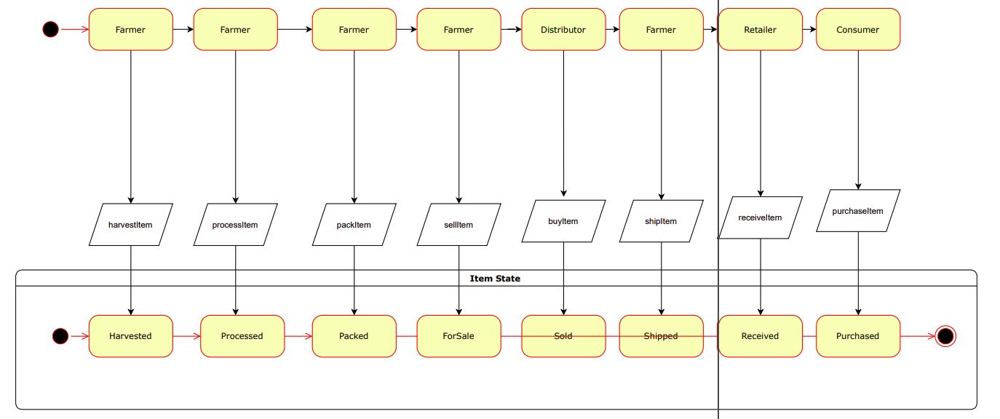

# Coffee Supply Chain Tracker

This NEAR blockchain project simulates a real-world use case of tracking the supply chain for a product through different actors, such as farmers, distributors, retailers and finally, consumers. 


## Contract

This repository includes a complete project structure for AssemblyScript contract for the supply chain targeting the NEAR platform.

The project is very minimal, but contains the following functionalities:


Contract file:
- **supply_chain** in the `src/simple` folder

## Usage

### Running the tests

Run `yarn test`:

Output:
```
[Describe]: SupplyChainContract

 [Success]: ✔ allows a farmer to harvest coffee
 [Success]: ✔ allows a farmer to process coffee
 [Success]: ✔ allows a farmer to pack coffee
 [Success]: ✔ allows a farmer to mark coffee for sale
 [Success]: ✔ allows a distributor to buy coffee
 [Success]: ✔ allows a retailer to mark coffee received
 [Success]: ✔ allows a retailer to mark coffee received
 [Success]: ✔ allows a consumer to purchase coffee

```
